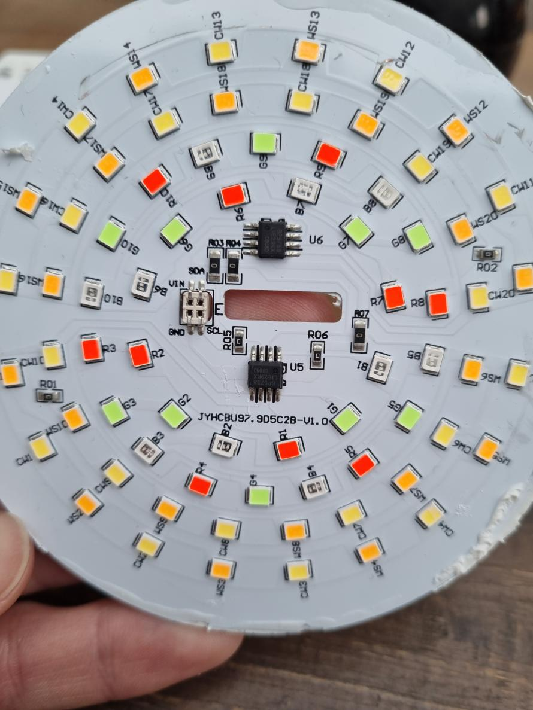

# IMPORTANT
--> make sure to copy both `bp5758.yaml` and `bp5758.h` <--

# BP5758 based tuya lamps support for ESPHome

# dynamic range mode

The BP5758 chip only allows 1024 brightness levels per channel, what makes it as bad as any other lamp at having good colors at dim levels and going very dim at all.
To improve upon that, this custom component dynamically changes the maximum current settings. As an example, my particular lamp used 26mA as a maximum, making the minimum possible level equal to 26mA/1024=0.025mA, which is also its resolution. Using dynamic range, when the lamp is asked to go dim, the esp will tell the bp5758 chip to set the maximum current to 1mA instead, pushing the minimum  to 1mA/1024=0.001mA, so 26 times less power and 26 times the color resolution at dim levels.
This is not how the chip is designed to be used, so to avoid flickering it was necessary to change the max level continuously and in small increments instead of just using one threshold. As is, it is super smooth.

You can test how static (intended) vs dynamic range (my hack) perform by using the lamp effects in HA's UI. The difference is massive.

# Links:

* Discord thread: https://discord.com/channels/429907082951524364/429907082955718657/944508806770065428